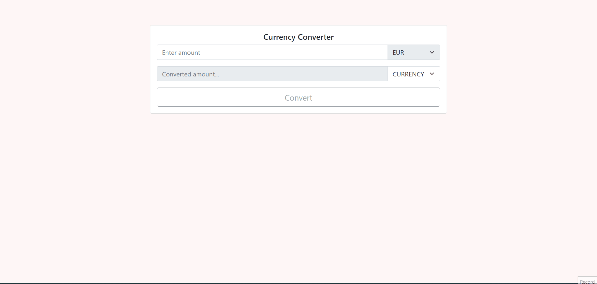

<h1 align="center">Currency Converter</h1>

## Table of Contents

- [Overview](#overview)
- [Built With](#built-with)
- [Features](#features)
- [How to use](#how-to-use)
- [Contact](#contact)

## Overview



### Built With

- React
- Bootstrap

## Features

This application was created with React & Bootstrap. For fetching the data 'fixer.io' is used as API source. Base currency is 'EUR' and can be converted to different currencies.

## How To Use

To clone and run this application, you'll need [Git](https://git-scm.com) and [Node.js](https://nodejs.org/en/download/) (which comes with [npm](http://npmjs.com)) installed on your computer. From your command line:

```bash
# Clone this repository
$ git clone https://github.com/sfkse/CurrencyConverter.git

# Install dependencies
$ npm install

# Run the app
$ npm start

# API KEY
- Replace your API Key with `process.env.REACT_APP_API_KEY`
```

## Contact

- GitHub [@sfkse](https://github.com/sfkse)
- Linkedin [@sefa Köse](https://www.linkedin.com/in/sefa-köse/)
